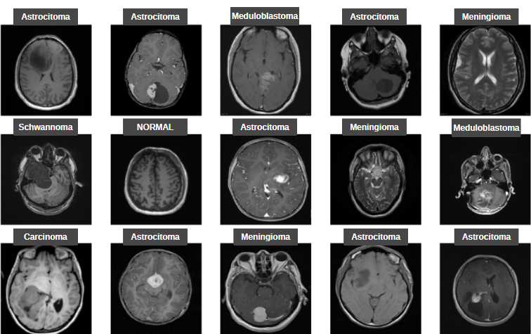

# BrainTumorClassification

## TR
Bu proje, T1, T1C+ ve T2 manyetik rezonans görüntüleri kullanılarak beyin tümörlerini sınıflandırmayı hedefleyen bir TensorFlow tabanlı derin öğrenim projesidir.

### Proje Açıklaması
* Beyin tümörleri, tıbbi alanda önemli bir sağlık sorunudur ve erken teşhis ve sınıflandırma, tedavi seçeneklerinin belirlenmesinde önemli bir rol oynar. Bu projede, T1, T1C+ ve T2 MRI görüntüleri kullanılarak, beyin tümörlerinin farklı türlerine ait MRI görüntülerin otomatik olarak sınıflandırılması amaçlanmaktadır.

### Veri Seti
* Proje için kullanılan [veri seti](https://www.kaggle.com/datasets/fernando2rad/brain-tumor-mri-images-44c?resource=download), Kaggle'da bulunan özel bir koleksiyon içerisindeki beyin tümörü görüntülerini içermektedir. Bu görüntüler, Astrocitoma, Carcinoma, Ependimoma, Ganglioglioma, Germinoma, Glioblastoma, Granuloma, Meduloblastoma, Meningioma, Neurocitoma, Oligodendroglioma, Oligodendroglioma, Oligodendroglioma, Papiloma, Schwannoma ve Tuberculoma olmak üzere 14 tümör türüne ve Normal beyin görüntülerine sahiptir. Toplam 4479 MRI görüntüsünden oluşmaktadır.

Görüntüler, herhangi bir işaretleme veya hastaya ait kimlik bilgisi olmadan sunulmuştur ve radyologlar tarafından yorumlanarak çalışma amaçları için sağlanmıştır.

Tüm modellerin başarım metrikleri "training results.xlsx" Excel tablolarında verilmiştir.
Veri kümesini egitim, saglama, ve test kumesi olarak ayırma işlemleri "data_split_csv.ipynb" not defterinde, görüntü kırpma işlemleri "ImageCrop.ipynb" not defterinde gerçekleştirilmiştir.
15 sınıf için hazırlanan modeller "15_Classes" klasöründe, 44 sınıf için hazırlanan modeller "44_Classes" klasöründe verimiştir.

## EN
This project is a TensorFlow based deep learning project that aims to classify brain tumors using T1, T1C+ and T2 magnetic resonance images.

### Project Description
* Brain tumors are a major health problem in the medical field and early detection and classification play an important role in determining treatment options. In this project, we aim to automatically classify MRI images of different types of brain tumors using T1, T1C+ and T2 MRI images.

### Data Set
* The [dataset](https://www.kaggle.com/datasets/fernando2rad/brain-tumor-mri-images-44c?resource=download) used for the project includes brain tumor images from a private collection on Kaggle. These images have 14 tumor types including Astrocytoma, Carcinoma, Ependymoma, Ganglioglioma, Germinoma, Glioblastoma, Granuloma, Meduloblastoma, Meningioma, Neurocytoma, Oligodendroglioma, Oligodendroglioma, Oligodendroglioma, Oligodendroglioma, Papiloma, Schwannoma and Tuberculoma, and Normal brain images. It consists of a total of 4479 MRI images.

The images are presented without any labeling or patient identification information and are interpreted by radiologists and provided for study purposes.

The performance metrics of all models are given in the Excel spreadsheet "training results.xlsx".
The splitting of the dataset into training, validation, and test set was done in the notebook "data_split_csv.ipynb" and image cropping was done in the notebook "ImageCrop.ipynb".
Models for 15 classes are stored in "15_Classes" folder, models for 44 classes are stored in "44_Classes" folder.

  

<h3> Those working with the same data </h3>

  * click [here](https://www.kaggle.com/datasets/fernando2rad/brain-tumor-mri-images-44c/code) to access previous studies

<h3> Developers </h3>
  
🧩 [Deniz Karhan](https://github.com/denizkarhan) 
🗝️ [İbrahim İnce](https://github.com/ibrahim-ince)
