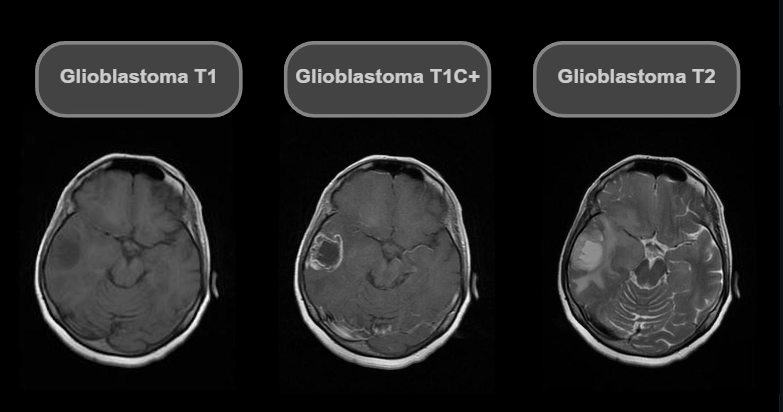
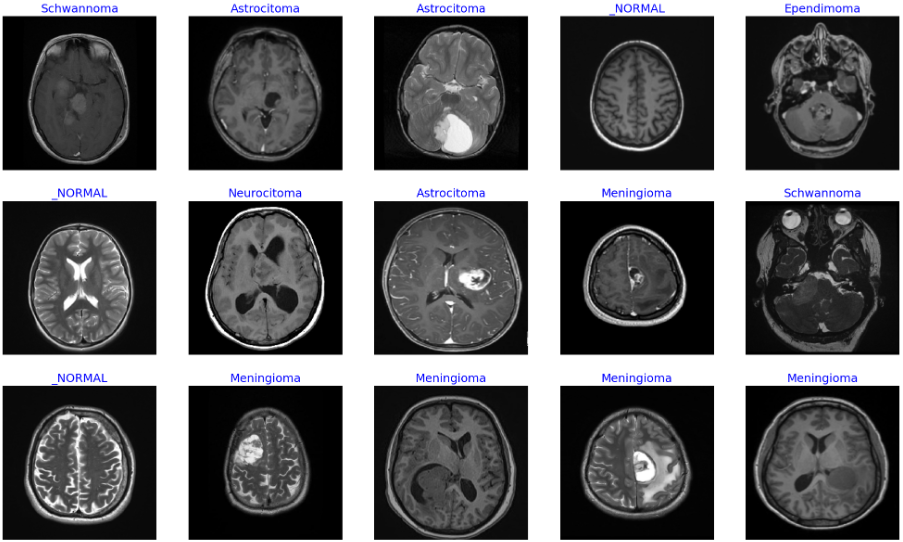

## Reference FERNANDO FELTRIN

Click [here](https://www.kaggle.com/datasets/fernando2rad/brain-tumor-mri-images-44c?resource=download) to access the kaggle dataset

## About Dataset

### TR

Bu koleksiyon, T1, kontrast artırılmış T1 ve T2 manyetik rezonans görüntülerini içerir. Görüntüler, herhangi bir işaretleme veya hastaya ait kimlik bilgisi olmadan sunulmuştur ve radyologlar tarafından yorumlanarak çalışma amaçları için sağlanmıştır.

Koleksiyondaki görüntüler astrocytoma, carcinoma, ependymoma, ganglioglioma, germinoma, glioblastoma, granuloma, medulloblastoma, meningioma, neurocytoma, oligodendroglioma, papilloma, schwannoma ve tuberculoma türündeki beyin tümörleri tarafından ayrıştırılmıştır.

### EN

A private collection of T1, contrast-enhanced T1, and T2 magnetic resonance images separated by brain tumor type.
Images without any type of marking or patient identification, interpreted by radiologists and provided for study purposes.

The images are separated by astrocytoma, carcinoma, ependymoma, ganglioglioma, germinoma, glioblastoma, granuloma, medulloblastoma, meningioma, neurocytoma, oligodendroglioma, papilloma, schwannoma and tuberculoma.

 
<h3>Brain Tumors</h3>

    

